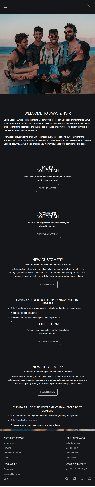

<!-- PROJECT SHIELDS -->

[![Contributors][contributors-shield]][contributors-url]
[![Forks][forks-shield]][forks-url]
[![Stargazers][stars-shield]][stars-url]
[![Issues][issues-shield]][issues-url]
[![MIT License][license-shield]][license-url]
[![LinkedIn][linkedin-shield]][linkedin-url]

<!-- PROJECT LOGO -->

<div align="center">
  

  <h3 align="center">Jaws&Noir</h3>
  
  <p align="center">
    Mediterranean inspired clothing store
    <br/>
    <a href="https://jawsstore.netlify.app/"><strong>Visit store</strong></a>    
    <br />
    <br />
    <em>⚠️ This is a fictional store made as a capstone project using React</em>
    <br />
    <a href="https://github.com/FranVlahovic/jaws-noir">Docs</a>  
    ·  
    <a href="https://github.com/FranVlahovic/jaws-noir/issues/new?labels=bug&template=bug-report---.md">Report Bug</a>  
    ·  
    <a href="https://github.com/FranVlahovic/jaws-noir/issues/new?labels=enhancement&template=feature-request---.md">Request Feature</a>  
  </p>
</div>

---

## Table of Contents

- [About The Project](#about-the-project)
- [Features](#features)
- [Gallery](#gallery)
- [Built With](#built-with)
- [Getting Started](#getting-started)
  - [Prerequisites](#prerequisites)
  - [Installation](#installation)
- [Usage](#usage)
- [Contributing](#contributing)
- [License](#license)
- [Contact](#contact)
- [Acknowledgments](#acknowledgments)

---

## About The Project

**Jaws Noir** is a fictional e-commerce store built as a **_capstone project_** for practicing front-end development with React. It focuses on component-based architecture, routing, and responsive design. The goal of the project was to apply modern development tools and techniques.

This project was a way to deepen my understanding of React and front-end through hands-on experience.

---

## Features

### Responsive design

Layout and elements adapt to different screen sizes—including mobile, tablet, and desktop—for a consistent user experience.

### Client Side Routing

Smooth navigation between pages is handled using [React Router](https://reactrouter.com/), without full page reloads.

### API Integration

Product data is fetched from a [Fake Store API](https://fakestoreapi.com/products) to simulate a real world e-commerce backend.

### Store Collections

Dedicated pages for browsing men’s and women’s clothing. Each product is displayed as a clickable item preview.

### Product Details

Each product page includes a title, description, price, size options and an **_Add to cart_** button.

### Login System

Users can log in with predefined credentials to access _"personalized features"_.

### Quick Access

Users are provided with predefined credentials instead of filling out a full registration form.

### Wishlist

Allows users to save and view favorite products for later. Wishlist saves data on **_Local Storage_**.

### Cart Sidebar

Slide panel that displays items added to the cart, shows the total cost, and allows item removal.

### Menu Sidebar (Mobile)

On smaller screens, a sliding sidebar menu replaces the navbar for easier mobile navigation.

---

## Gallery

### Images

#### Original Version

<div align="center">
  
  
  
  ---
  
  
  
  
  
  
  
</div>

#### Tablet Version

<div align="center">
    
    
    
    
    
    
    
    
</div>

#### Mobile Version

<div align="center">  
  
  
  
  
  
  
  
</div>

## Built With

<div style="display: flex; gap: 20px; align-items: end;">
  <div style="text-align: center;">
    <a href="https://www.w3schools.com/css/" target="_blank" rel="noreferrer">
      
    </a>
    <div>CSS3</div>
  </div>

  <div style="text-align: center;">
    <a href="https://www.w3.org/html/" target="_blank" rel="noreferrer">
      
    </a>
    <div>HTML5</div>
  </div>

  <div style="text-align: center;">
    <a href="https://developer.mozilla.org/en-US/docs/Web/JavaScript" target="_blank" rel="noreferrer">
      
    </a>
    <div>JavaScript</div>
  </div>

  <div style="text-align: center;">
    <a href="https://reactjs.org/" target="_blank" rel="noreferrer">
      
    </a>
    <div>React</div>
  </div>
</div>

---

## Getting Started

To set up a local copy, follow these steps:

### Prerequisites

- Ensure [Node.js](https://nodejs.org/) is installed.

### Installation

1. Clone the repository:
   ```sh
   git clone https://github.com/FranVlahovic/jaws-noir.git
   ```
2. Navigate to the project directory:
   ```sh
   cd jaws-noir
   ```
3. Install all dependencies:
   ```sh
   npm install
   ```

---

## Usage

To start the development environment:

```sh
npm start
```

Build for production:

```sh
npm run build
```

---

## Contributing

Contributions are welcome! To contribute:

1. Fork the repository.
2. Create your branch (`git checkout -b feature/YourFeature`).
3. Commit changes (`git commit -m 'Add your feature'`).
4. Push the branch (`git push origin feature/YourFeature`).
5. Open a pull request.

---

## License

Distributed under the MIT License. See [MIT License](./LICENSE) for details.

---

## Contact

Fran Vlahovic - [LinkedIn](https://linkedin.com/in/franvlahovic)

Email: franvlahovic@proton.me

Project Link: [https://github.com/FranVlahovic/jaws-noir](https://github.com/FranVlahovic/jaws-noir)

---

## Acknowledgments

- [The Odin Project](https://www.theodinproject.com/)
- [MDN Web Docs](https://developer.mozilla.org/)
- [Fake Store API](https://fakestoreapi.com/)
- [Unsplash](https://unsplash.com/)

<!-- MARKDOWN LINKS & IMAGES -->

[contributors-shield]: https://img.shields.io/github/contributors/FranVlahovic/jaws-noir.svg?style=for-the-badge
[contributors-url]: https://github.com/FranVlahovic/jaws-noir/graphs/contributors
[forks-shield]: https://img.shields.io/github/forks/FranVlahovic/jaws-noir.svg?style=for-the-badge
[forks-url]: https://github.com/FranVlahovic/jaws-noir/network/members
[stars-shield]: https://img.shields.io/github/stars/FranVlahovic/jaws-noir.svg?style=for-the-badge
[stars-url]: https://github.com/FranVlahovic/jaws-noir/stargazers
[issues-shield]: https://img.shields.io/github/issues/FranVlahovic/jaws-noir.svg?style=for-the-badge
[issues-url]: https://github.com/FranVlahovic/jaws-noir/issues
[license-shield]: https://img.shields.io/github/license/FranVlahovic/jaws-noir.svg?style=for-the-badge
[license-url]: https://github.com/FranVlahovic/jaws-noir/blob/main/LICENSE
[linkedin-shield]: https://img.shields.io/badge/-LinkedIn-blue.svg?style=for-the-badge&logo=linkedin&logoColor=white
[linkedin-url]: https://linkedin.com/in/franvlahovic

---
